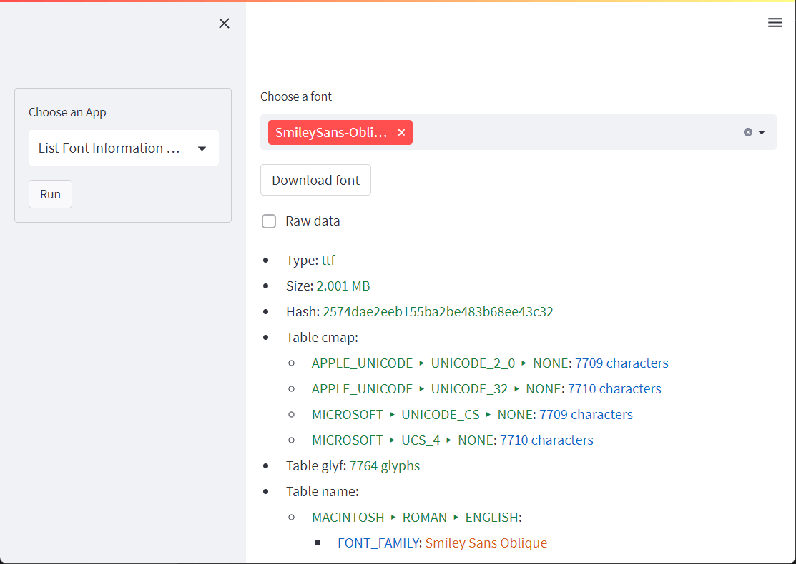
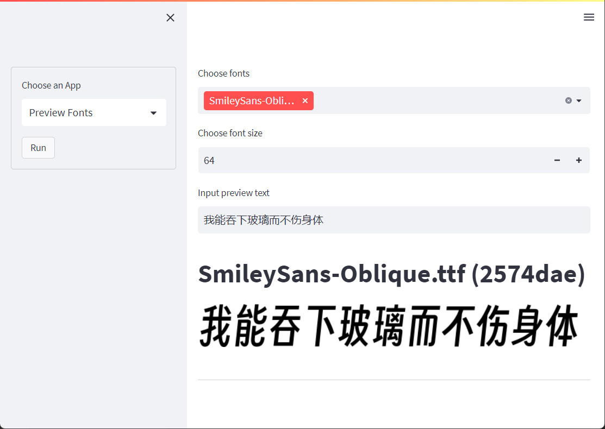
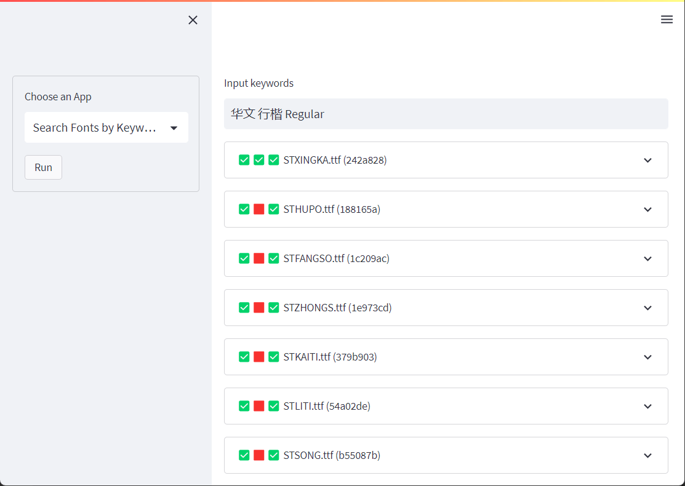
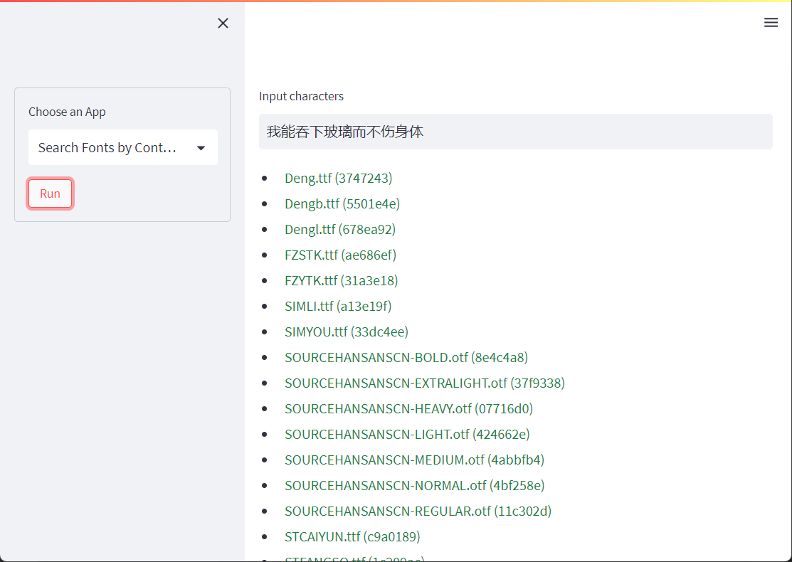
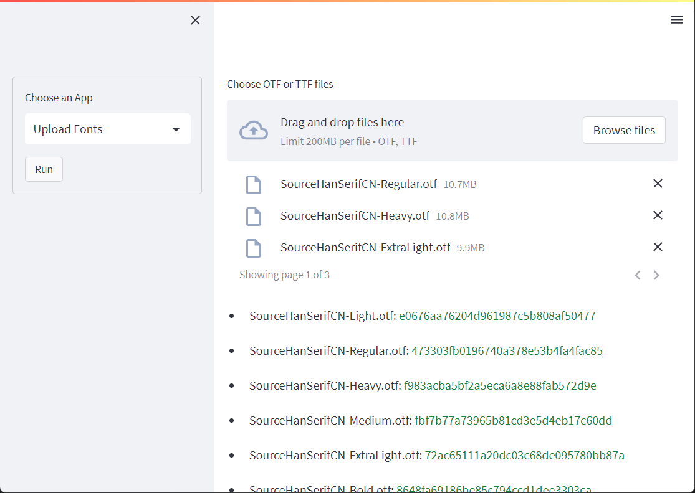

<!-- Template from https://github.com/othneildrew/Best-README-Template -->

<!-- PROJECT LOGO -->
 

  <a href="https://github.com/iydon/fonthub">
    ⚫⬛⬛⬛ 
    ⬜⬛⬜⬜ 
    ⬜⬛⬛⬜ 
    ⬜⬛⬜⬜ 
  </a>

  <h3 align="center">Font Sharing Web App (Streamlit)</h3>

  

    <a href="https://github.com/iydon/fonthub/blob/main/app.py">View Demo</a>
    ·
    <a href="https://github.com/iydon/fonthub/issues">Report Bug</a>
    ·
    <a href="https://github.com/iydon/fonthub/issues">Request Feature</a>
  

<!-- STREAMLIT APP -->
# Streamlit App Features

  
<strong>List Font Information and Download</strong>

  

  
<strong>Preview Fonts</strong>

  

  
<strong>Search Fonts by Keywords</strong>

  

  
<strong>Search Fonts by Contained Characters</strong>

  

  
<strong>Upload Fonts</strong>

  

